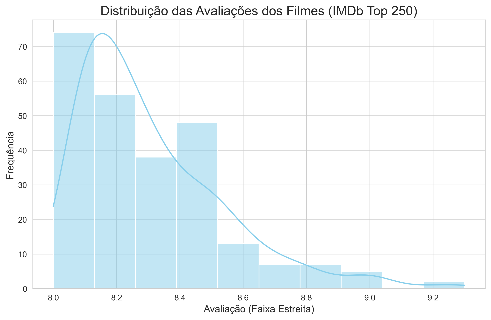
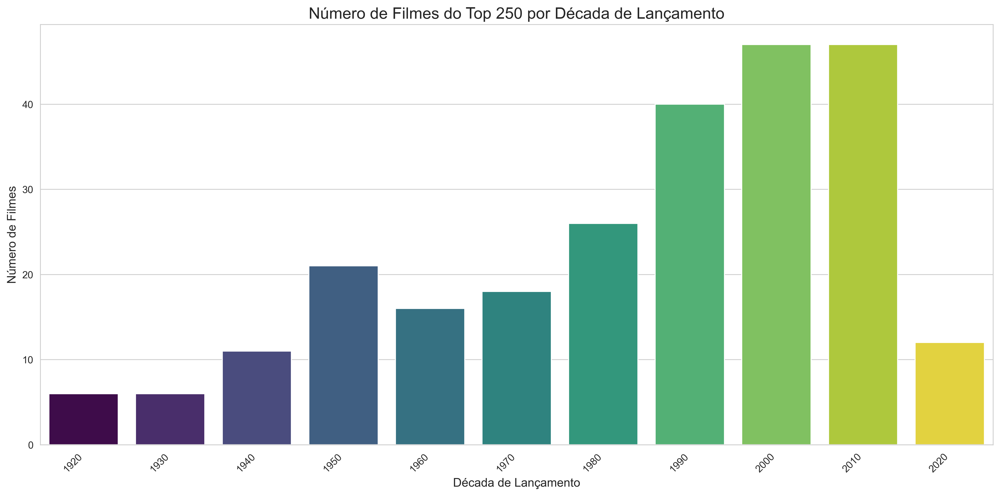
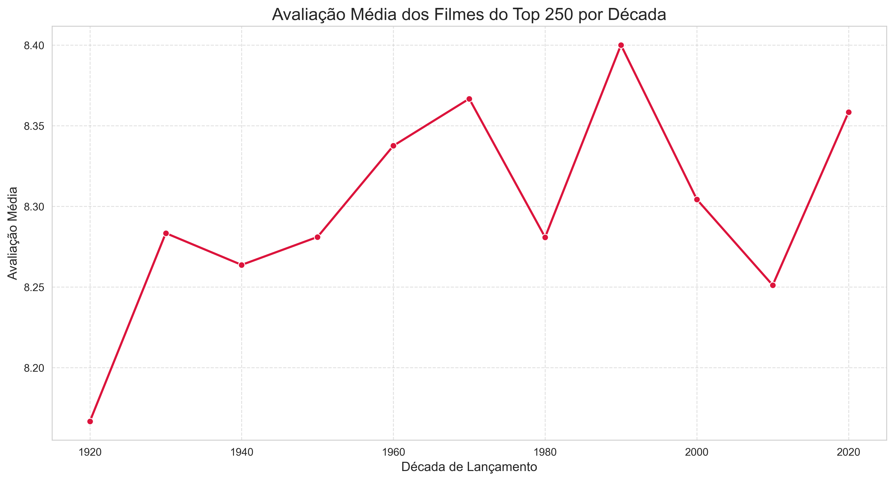
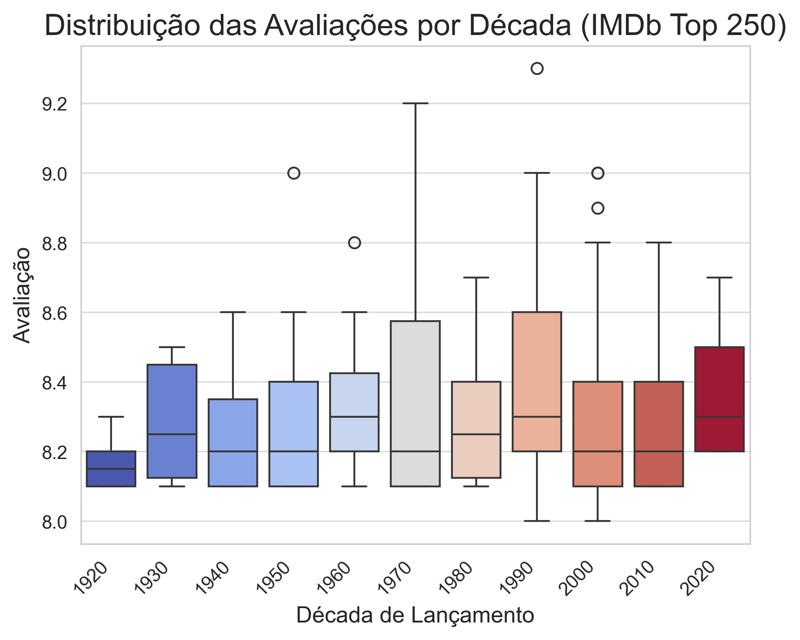
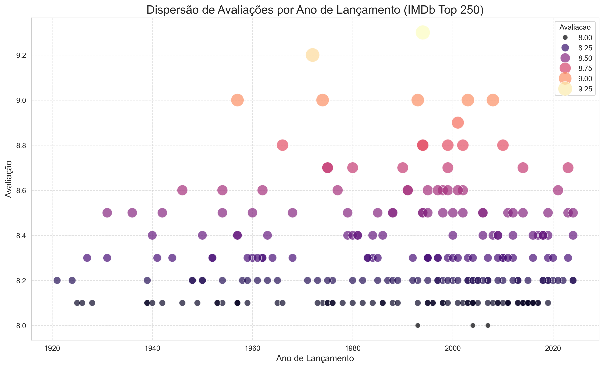
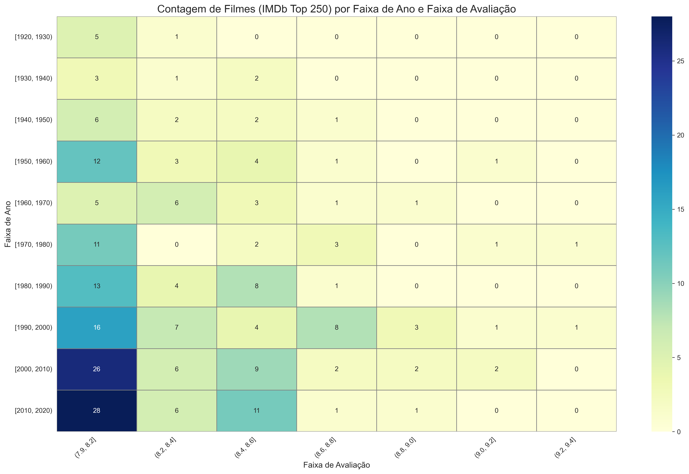

# Análise Exploratória de Dados de Filmes do IMDb

---

## 📄 Descrição do Projeto

Este projeto tem como objetivo realizar a coleta de dados (web scraping) de informações de filmes do site [IMDb (Internet Movie Database)](https://www.imdb.com/), utilizando a biblioteca **Selenium** em Python. Após a coleta, os dados são organizados, limpos e submetidos a uma **Análise Exploratória de Dados (EDA)** com as bibliotecas **Pandas**, **NumPy**, **Matplotlib** e **Seaborn**.

O propósito é extrair insights sobre filmes, focando agora em uma amostra de **filmes altamente aclamados** (Top 250), buscando entender a distribuição de suas avaliações, a frequência de lançamentos por décadas e a relação entre o ano de lançamento e a avaliação.

## 🚀 Tecnologias Utilizadas

* **Python:** Linguagem de programação principal.
* **Selenium:** Para web scraping e automação de navegador.
* **Pandas:** Para manipulação e análise de dados.
* **NumPy:** Para operações numéricas de alto desempenho.
* **Matplotlib:** Para criação de gráficos estáticos.
* **Seaborn:** Para visualizações estatísticas mais atraentes.

## ⚙️ Como Executar o Projeto

Siga os passos abaixo para configurar e rodar o projeto em sua máquina local:

### Pré-requisitos

Certifique-se de ter o **Python** (preferencialmente via [Anaconda](https://www.anaconda.com/download)) instalado.

Você também precisará do **ChromeDriver** compatível com a versão do seu navegador Google Chrome.
1.  Verifique a versão do seu Chrome (Ajustes > Ajuda > Sobre o Google Chrome).
2.  Baixe o ChromeDriver correspondente em [https://chromedriver.chromium.org/downloads](https://chromedriver.chromium.org/downloads).
3.  Descompacte o arquivo e coloque o executável `chromedriver.exe` (ou `chromedriver` em macOS/Linux) em uma pasta chamada `drivers` na raiz do seu projeto.

Exemplo de estrutura de pasta:
```
seu_projeto_imdb/
├── drivers/
│   └── chromedriver.exe  (ou chromedriver)
├── images/
└── imdb_scraper.py
```

### Instalação das Dependências

Abra o terminal (ou **Anaconda Prompt** se estiver usando Anaconda) na pasta raiz do projeto e execute o comando:

```bash
pip install selenium pandas numpy matplotlib seaborn
```
### Execução do Script
Após instalar as dependências e configurar o ChromeDriver, execute o script Python:

```Bash

python imdb_scraper.py
```
O script irá:
1. Abrir uma janela do navegador Chrome.

2. Navegar até a página da lista IMDb Top 250 Filmes (https://www.imdb.com/chart/top/) para coleta de dados.
3. Coletar informações de filmes (Título, Ano, Avaliação).
4. Processar e limpar os dados com Pandas, garantindo a cor reção dos tipos de dados e a remoção de entradas incompletas.
5. Gerar e exibir diversos gráficos de análise exploratória de dados, focados nos insights da lista Top 250.

## 📊 Análise e Visualizações

Nesta etapa, o script realiza uma Análise Exploratória de Dados (EDA) aprofundada nos filmes do IMDb Top 250. As visualizações são projetadas para revelar tendências e características específicas deste conjunto de dados de alta qualidade:

### Estatísticas Descritivas

- df.info() e df.describe() foram usados para obter um panorama numérico dos dados limpos.

### Distribuição das Avaliações

- Foi criado um histograma com KDE para ilustrar a estreita faixa de avaliações dos filmes mais bem classificados, confirmando sua alta qualidade inerente.



### Contagem de Filmes por Década

- Foi criado um gráfico de barras que mostra a concentração de filmes do Top 250 por década de lançamento, revelando períodos de maior produção de clássicos.



### Avaliação Média por Década

- Gráfico de linha foi produzido para visualizar como a avaliação média se comporta ao longo das décadas, dentro do seleto grupo do Top 250.



### Box Plot de Avaliações por Década

- Um Box Plot detalhado para cada década, permitindo observar a mediana, quartis e identificar os "outliers de qualidade" — filmes com avaliações excepcionalmente altas mesmo dentro dessa lista de elite.



### Dispersão Ano vs. Avaliação

- Gráfico de dispersão para identificar a relação individual entre o ano de lançamento e a avaliação dos filmes, destacando tendências ou filmes isolados de alta performance.



### Contagem de Filmes por Faixa de Ano e Avaliação (Heatmap)

- Este heatmap visualiza a concentração de filmes (do Top 250) por década e por faixa de avaliação, destacando onde os filmes de alta qualidade se agrupam ao longo do tempo.



### Top 10 Filmes por Avaliação

- Uma lista dos 10 filmes com as maiores avaliações da base de dados coletada.

``` 
Titulo                                  Ano        Avaliacao
Um Sonho de Liberdade                   1994       9.3
O Poderoso Chefão                       1972       9.2
Batman: O Cavaleiro das Trevas          2008       9.0
O Poderoso Chefão: Parte II             1974       9.0
12 Homens e uma Sentença                1957       9.0
O Senhor dos Anéis: O Retorno do Rei    2003       9.0
A Lista de Schindler                    1993       9.0
O Senhor dos Anéis: A Sociedade do Anel 2001       8.9
O Senhor dos Anéis: As Duas Torres      2002       8.8
Clube da Luta                           1999       8.8
```

## 💡 Conclusões e Insights
A análise dos dados do IMDb Top 250 Filmes revelou padrões interessantes sobre o que constitui um "clássico atemporal":

- Consistência de Alta Avaliação: Como esperado, a lista é dominada por filmes com avaliações excepcionalmente altas (maiores que 8.0), com pouca variação, o que reforça o critério de seleção do IMDb para essa lista.

- *Distribuição Histórica da Qualidade:* Os gráficos por década demonstram que filmes aclamados vêm de todas as épocas, com representação significativa desde as décadas mais antigas até as mais recentes.

- "Outliers de Qualidade": Mesmo em uma lista de filmes de alta qualidade, foi possível identificar "outliers" no box plot de avaliações por década, que representam filmes que superam ligeiramente a já alta média de suas respectivas décadas, solidificando seu status como os "melhores dos melhores".

- Desafio dos Filmes Recentes: Uma observação notável é que, mesmo com o aumento do volume de filmes produzidos e lançados a partir da década de 2010 até 2020, os filmes dessas décadas, até o momento, não alcançaram a marca de avaliações acima de 9.0 na lista do Top 250. Isso sugere uma possível barreira para filmes mais recentes atingirem os patamares de avaliação mais altos, talvez devido à falta de perspectiva histórica ou à mudança nas preferências do público ao longo do tempo, em comparação com os clássicos estabelecidos.

## 🚧 Desafios e Próximos Passos
Inicialmente, a coleta de dados da página de "Filmes Mais Populares" (/chart/moviemeter/) resultou em uma concentração excessiva de filmes recentes (e futuros), o que limitou a profundidade da análise histórica. Este desafio foi superado ao ajustar o web scraping para coletar dados da página IMDb Top 250 Filmes (https://www.imdb.com/chart/top/), que oferece uma amostra de filmes mais diversificada em termos de ano de lançamento.

A refatoração da EDA e visualizações foi realizada para melhor se adequar às características dessa nova fonte de dados, focando em análises por década e na identificação de filmes de destaque.

### Próximos Passos:

- Explorar a coleta de gêneros dos filmes para uma análise mais detalhada (e.g., quais gêneros são mais representados no Top 250, ou quais têm as avaliações mais altas).
- Se possível, coletar o número de votos para analisar a relação entre a avaliação e o volume de engajamento do público.
- Desenvolver um modelo de recomendação simples baseado nas avaliações e gêneros.

## 🤝 Contribuições
Contribuições são bem-vindas! Se tiver sugestões ou melhorias, sinta-se à vontade para abrir uma issue ou enviar um pull request.

## 📝 Licença
Este projeto está licenciado sob a Licença MIT.
